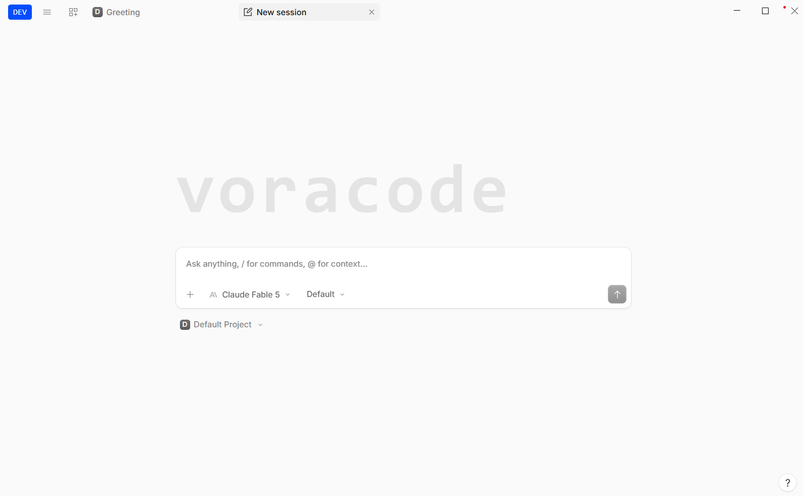

<div align="center">

# **VORACODE**

### The AI Operating System for Developers

**One CLI. Any LLM. Unlimited Workflows.**

---

[](https://github.com/mysterious75/voracode/releases)
[](https://www.npmjs.com/package/voracode)
[](https://www.npmjs.com/package/voracode)
[](https://github.com/mysterious75/voracode/blob/master/LICENSE)
[](https://discord.gg/voracode)
[](https://github.com/mysterious75/voracode)

[Website](https://voracode.voraprotocol.com) · [Download](https://github.com/mysterious75/voracode/releases) · [Discord](https://discord.gg/voracode) · [X/Twitter](https://x.com/voracode)

</div>

---

<div align="center">
  
  <br>
  <em>Voracode runs natively on Windows, macOS, and Linux.</em>
</div>

---

## Why Voracode?

Most AI coding tools lock you into one provider. Claude Code only works with Claude. Gemini CLI only works with Gemini.

**Voracode breaks that lock-in.**

Use any provider, any model, any workflow — from one fast CLI. Switch between Claude, GPT, Gemini, DeepSeek, or run local models with Ollama. Your workflow stays the same.

```bash
voracode  # That's it. You're in.
```

---

## Features

| Category | Features |
|----------|----------|
| **Providers** | 75+ AI providers — OpenAI, Anthropic, Google, DeepSeek, xAI, Ollama, and more |
| **Models** | GPT-4.1, Claude Opus 4.8, Gemini 2.5 Pro, DeepSeek V4, Llama 4, and 100+ models |
| **Context** | 1M+ token context window — entire codebase understanding |
| **Agents** | Build, Plan, and General agents with autonomous tool execution |
| **Tools** | File editing, terminal, web search, codesearch, MCP servers |
| **Interface** | TUI (terminal), Web UI, Desktop App — same experience everywhere |
| **Sessions** | Persistent sessions, timeline, history, and context management |
| **MCP** | Full Model Context Protocol support — connect any MCP server |
| **LSP** | Language Server Protocol integration for code intelligence |
| **Git** | Git-aware context, branch management, commit history |
| **BYOK** | Bring Your Own Key — use your own API keys, no vendor lock-in |
| **Open Source** | MIT licensed — inspect, modify, and contribute |

---

## Comparison

| Feature | Voracode | Claude Code | Cursor | Windsurf | GitHub Copilot |
|---------|:--------:|:-----------:|:------:|:--------:|:--------------:|
| Multi-Provider | ✅ | ❌ | Partial | Partial | ❌ |
| Local Models | ✅ | ❌ | ❌ | ❌ | ❌ |
| 1M Context | ✅ | ✅ | ❌ | ❌ | ❌ |
| Desktop App | ✅ | ❌ | ✅ | ✅ | ❌ |
| TUI (Terminal) | ✅ | ✅ | ❌ | ❌ | ❌ |
| Web UI | ✅ | ❌ | ❌ | ❌ | ❌ |
| MCP Protocol | ✅ | ✅ | ❌ | ❌ | ❌ |
| Open Source | ✅ | ❌ | ❌ | ❌ | ❌ |
| BYOK | ✅ | ❌ | ✅ | ✅ | ❌ |
| Free Tier | ✅ | ❌ | ❌ | ❌ | Limited |

---

## Installation

### Desktop App

Download the latest release for your platform:

| Platform | Download |
|----------|----------|
| **Windows** | [`.exe` Installer](https://github.com/mysterious75/voracode/releases/latest) |
| **macOS (Apple Silicon)** | [`.dmg` (arm64)](https://github.com/mysterious75/voracode/releases/latest) |
| **macOS (Intel)** | [`.dmg` (x64)](https://github.com/mysterious75/voracode/releases/latest) |
| **Linux** | [`.deb`](https://github.com/mysterious75/voracode/releases/latest) · [`.AppImage`](https://github.com/mysterious75/voracode/releases/latest) |

### CLI

```bash
# npm
npm i -g voracode@latest

# pnpm
pnpm i -g voracode@latest

# bun
bun i -g voracode@latest

# npx (no install required)
npx voracode@latest
```

<details>
<summary><strong>Other Package Managers</strong></summary>

```bash
# macOS / Linux (Homebrew)
brew install mysterious75/tap/voracode

# Windows (Scoop)
scoop install voracode

# Windows (Chocolatey)
choco install voracode
```

</details>

---

## Quick Start

```bash
# 1. Start Voracode in any project directory
cd your-project
voracode

# 2. Configure your API key (first time only)
# Settings → Providers → Add your API key

# 3. Start coding with AI
> Explain the architecture of this project
> Add error handling to the API endpoints
> Refactor the database layer

# 4. Switch agents with Tab
#    Build (full access) → Plan (read-only) → General (subagent)
```

---

## Commands

```bash
voracode                    # Start interactive TUI
voracode /path/to/project   # Open in specific directory
voracode -p "explain this"  # Non-interactive prompt
voracode serve              # Start headless API server
voracode serve --port 8080  # Custom port
voracode web                # Start server + web UI
voracode doctor             # Diagnose configuration issues
voracode update             # Update to latest version
```

---

## Supported Providers

Voracode supports **75+ AI providers** out of the box. Bring your own API key — no vendor lock-in.

| Provider | Models | Free Tier |
|----------|--------|-----------|
| **OpenAI** | GPT-4.1, GPT-4o, o3, o4-mini | $5 credits |
| **Anthropic** | Claude Opus 4.8, Sonnet 4, Haiku | — |
| **Google** | Gemini 2.5 Pro, Flash, Gemma | Generous free |
| **DeepSeek** | V4 Flash, R1, V3 | Very cheap |
| **xAI** | Grok 3, Grok 3 Mini | Free credits |
| **Moonshot** | Kimi K3, Moonshot v1 | Free tier |
| **Zhipu** | GLM-4, GLM-4-Flash | Free tier |
| **Ollama** | Llama 4, Mistral, Qwen, Phi-4 | Free (local) |
| **+ 65 more** | See full list | — |

---

## Architecture

```
                          ┌─────────────────┐
                          │   Voracode CLI   │
                          └────────┬────────┘
                                   │
           ┌───────────────────────┼───────────────────────┐
           │                       │                       │
           ▼                       ▼                       ▼
    ┌─────────────┐        ┌─────────────┐        ┌─────────────┐
    │   Providers  │        │   Agents    │        │    Tools    │
    └──────┬──────┘        └──────┬──────┘        └──────┬──────┘
           │                       │                       │
     ┌─────┴─────┐           ┌─────┴─────┐           ┌─────┴─────┐
     │           │           │           │           │           │
     ▼           ▼           ▼           ▼           ▼           ▼
 ┌───────┐ ┌───────┐   ┌───────┐ ┌───────┐   ┌───────┐ ┌───────┐
 │Claude │ │  GPT  │   │ Build │ │ Plan  │   │  Edit │ │ Bash  │
 │Gemini │ │DeepS. │   │ Agent │ │ Agent │   │ Files │ │  Run  │
 │Ollama │ │ ...   │   │       │ │       │   │Search │ │ MCP   │
 └───────┘ └───────┘   └───────┘ └───────┘   └───────┘ └───────┘
```

---

## MCP Integration

Connect any MCP server to extend Voracode's capabilities:

```json
{
  "mcp": {
    "github": {
      "type": "local",
      "command": ["npx", "-y", "@modelcontextprotocol/server-github"],
      "environment": {
        "GITHUB_TOKEN": "your-token"
      }
    },
    "postgres": {
      "type": "local",
      "command": ["npx", "-y", "@modelcontextprotocol/server-postgres"],
      "environment": {
        "DATABASE_URL": "postgresql://localhost/mydb"
      }
    }
  }
}
```

---

## Configuration

```json
{
  "$schema": "https://raw.githubusercontent.com/mysterious75/voracode/master/packages/voracode/src/config/schema.json",
  "provider": {
    "anthropic": {
      "apiKey": "sk-ant-..."
    }
  },
  "theme": "purple"
}
```

---

## Roadmap

| Status | Feature |
|:------:|---------|
| ✅ | CLI Interface (TUI + Web + Desktop) |
| ✅ | 75+ AI Provider Support |
| ✅ | Autonomous Agent System |
| ✅ | MCP Protocol Integration |
| ✅ | Session Management & History |
| ✅ | Desktop App (Windows, macOS, Linux) |
| ✅ | Codesearch (BM25 Semantic Search) |
| 🚧 | Cloud Sync & Backup |
| 🚧 | Team Workspaces & Collaboration |
| 🚧 | Plugin Marketplace |
| 🚧 | Voice Input |
| 🚧 | Mobile Companion App |
| 🚧 | AI Memory & Learning |

---

## Contributing

We welcome contributions! See [CONTRIBUTING.md](./CONTRIBUTING.md) for guidelines.

```bash
git clone https://github.com/mysterious75/voracode.git
cd voracode
bun install
bun dev
```

---

## License

MIT © [mysterious75](https://github.com/mysterious75)

---

<p align="center">
  Built with ❤️ by the Voracode community
</p>

<p align="center">
  <a href="https://github.com/mysterious75/voracode">GitHub</a> · 
  <a href="https://discord.gg/voracode">Discord</a> · 
  <a href="https://x.com/voracode">X/Twitter</a> ·
  <a href="https://voracode.voraprotocol.com">Website</a>
</p>
